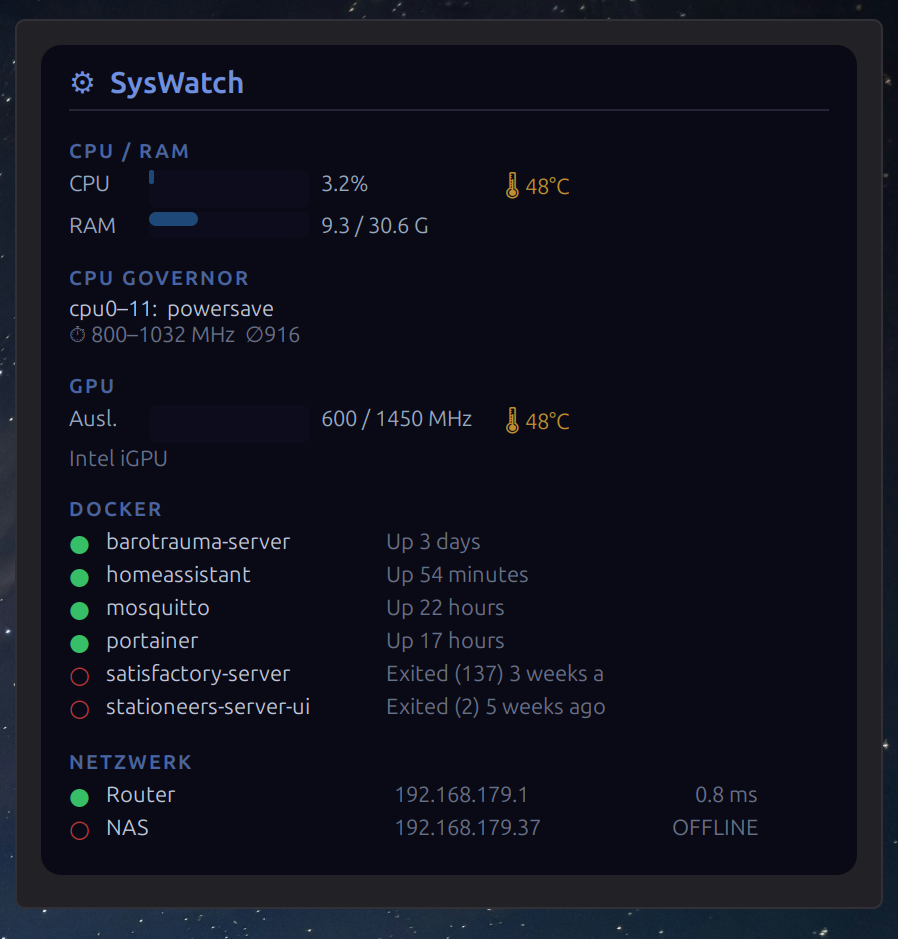

# SysWatch — Cinnamon System Monitor Desklet

A dark-themed system monitoring desklet for the [Cinnamon desktop](https://projects.linuxmint.com/cinnamon/) (Linux Mint / Arch / Debian).  
Displays CPU, RAM, GPU, CPU governor, Docker containers and network host availability — all in one compact HUD widget.



---

## Features

| Section | Details |
|---|---|
| **CPU / RAM** | Usage bars with colour thresholds (green → amber → red), optional per-core mini-bars |
| **CPU Temperature** | Reads `coretemp` Package sensor; falls back to `k10temp` / `zenpower` / `acpitz`. Bogus values (< −50 °C) are discarded. |
| **CPU Governor** | Current scaling governor per core group + frequency range |
| **GPU** | Auto-detects NVIDIA (nvidia-smi), AMD (amdgpu/radeon sysfs), Intel iGPU (i915/Xe freq ratio), Qualcomm Adreno (kgsl), ARM Mali, VideoCore (RPi). Section is hidden if no GPU is found. |
| **GPU Temperature** | Dedicated sensor per vendor; Intel iGPU falls back to CPU Package temp (shared die). |
| **Docker** | Lists all containers sorted by state (running first), configurable max count |
| **Network** | ICMP ping with latency for any number of user-defined hosts |
| **i18n** | 18 languages: de, fr, es, it, pt_BR, nl, pl, ru, zh_CN, ja, tr, cs, sv, ko, uk, fi, da, ar |
| **Temperature unit** | Celsius or Fahrenheit — switchable in settings |

---

## Installation

### Manual

```bash
# Clone into the Cinnamon desklets directory
git clone https://github.com/mkirchn/syswatch-desklet \
    ~/.local/share/cinnamon/desklets/syswatch@marian

# Compile translations
cd ~/.local/share/cinnamon/desklets/syswatch@marian
bash install-translations.sh
```

Then right-click the desktop → *Add Desklets* → search for **SysWatch** → *Add to desktop*.

### Dependencies

| Package | Purpose |
|---|---|
| `gettext` | Compile `.po` → `.mo` translation files |
| `docker` (optional) | Docker section |
| `nvidia-smi` (optional) | NVIDIA GPU support |
| `vcgencmd` (optional) | Raspberry Pi VideoCore GPU |

---

## Configuration

Right-click the desklet → *Configure*:

- **Allgemein / General** — refresh intervals, enable/disable sections (CPU temp, per-core view, GPU, Docker), temperature unit (°C / °F)
- **Netzwerk / Network** — add/remove monitored hosts (name + IP or hostname)
- **Darstellung / Display** — progress bar width

---

## GPU Support

| Vendor | Detection method | Utilisation source | Temperature source |
|---|---|---|---|
| NVIDIA | `nvidia-smi` | Reported % | Reported °C |
| AMD | `amdgpu`/`radeon` sysfs | `gpu_busy_percent` | hwmon (`amdgpu`/`radeon`) |
| Intel iGPU | i915/Xe sysfs | `gt_act_freq / gt_max_freq` | Package temp (shared die) |
| Qualcomm Adreno | kgsl sysfs | `gpu_busy_percentage` | thermal zone |
| ARM Mali | panfrost/bifrost/valhall sysfs | `utilization` | mali hwmon |
| VideoCore (RPi) | `vcgencmd measure_temp` | — | `temp=` output |

If no GPU is detected the section is automatically hidden.

---

## Translations

Install or update translations after cloning:

```bash
bash install-translations.sh
```

To add a new language, copy `po/syswatch@marian.pot` to `po/<lang>.po`, fill in the `msgstr` fields and run the script again.

---

## Compatibility

Tested on **Cinnamon 6.6** (Linux Mint 22). The `settings-schema.json` lists compatibility from Cinnamon 5.0 through 6.6.

---

## License

MIT — see [LICENSE](LICENSE).
